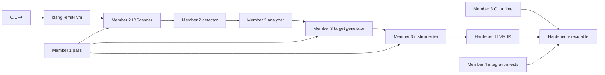

# Member 1: Architecture and Progress

## Review 1 corrections

The actual Review 1 feedback was not supplied when this repository was generated, so this section deliberately does not invent feedback. Before Review 3, record each real comment, the change that closed it, and the verification command used.

## Architecture

The pass follows five stages: `IRScanner` walks every instruction; `IndirectCallDetector` selects indirect `CallBase` instructions; `SignatureAnalyzer` produces a canonical signature key; `TargetGenerator` maps keys to address-taken module functions; and `InstrumentationEngine` emits a cached target array and runtime check. The separation keeps traversal, policy, target discovery, and IR mutation independently testable.

## Integration diagram

## Progress tracker

| Module | Planned | Completed | Evidence |
|---|---|---|---|
| Interfaces | Shared headers | Implemented | Header contracts in all member folders |
| Scanner | Walk module IR | Implemented | `IRScanner.cpp` |
| Detector | CallBase, direct-call exclusion | Implemented | `IndirectCallDetector.cpp` |
| Analyzer | Canonical function type | Implemented | `SignatureAnalyzer.cpp` |
| Generator | Address-taken target map | Implemented | `TargetGenerator.cpp` |
| Instrumenter | Cached globals and runtime call | Implemented | `InstrumentationEngine.cpp` |
| Integration | Build and live tests | Implemented & Verified | `scripts/build.sh`, `scripts/run_tests.sh` pass with live logs |

## Milestone plan

1. Install and record the actual LLVM version.
2. Configure and compile the plugin and unit tests.
3. Run positive, negative, boundary, and performance integration tests.
4. Replace the placeholder Review 1 and contributor metadata with verified project facts.
5. For Review 3, decide whether diagnostics, duplicate instrumentation protection, and Windows-native support need hardening.
