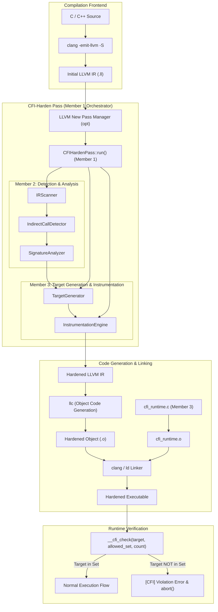

# CFI-Harden Architecture and Integration Diagram

## End-to-End Pipeline

The diagram below illustrates the 5-stage compilation and runtime pipeline, showing how source code is lowered, transformed by each member's module within the LLVM new pass manager, and linked against the CFI runtime library.

## Module Responsibility Matrix

| Stage | Responsible Member | Component | Responsibility |
|---|---|---|---|
| **1. Orchestration** | Member 1 | `CFIHardenPass` | Traverses module, registers pass with LLVM PassBuilder (`cfi-harden`), orchestrates stages. |
| **2. Scanning** | Member 2 | `IRScanner` | Walks `Module -> Function -> BasicBlock -> Instruction`. |
| **3. Detection** | Member 2 | `IndirectCallDetector` | Identifies `llvm::CallBase` without direct function target (covers both calls and invokes). |
| **4. Signature Analysis** | Member 2 | `SignatureAnalyzer` | Generates canonical signature strings from `FunctionType` (return, args, vararg). |
| **5. Target Generation** | Member 3 | `TargetGenerator` | Gathers address-taken module functions grouped by canonical signature. |
| **6. Instrumentation** | Member 3 | `InstrumentationEngine` | Emits cached global target arrays and inserts `__cfi_check` calls before indirect call sites. |
| **7. Runtime** | Member 3 | `cfi_runtime.c` | Performs runtime membership checks in constant global tables and aborts on violation. |
| **8. Integration & Testing** | Member 4 | `scripts/`, `tests/` | Builds the pass, compiles test cases, verifies security, boundary, and performance overhead. |

